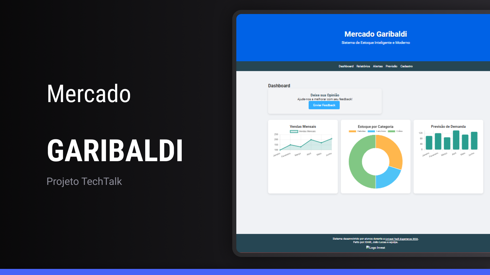
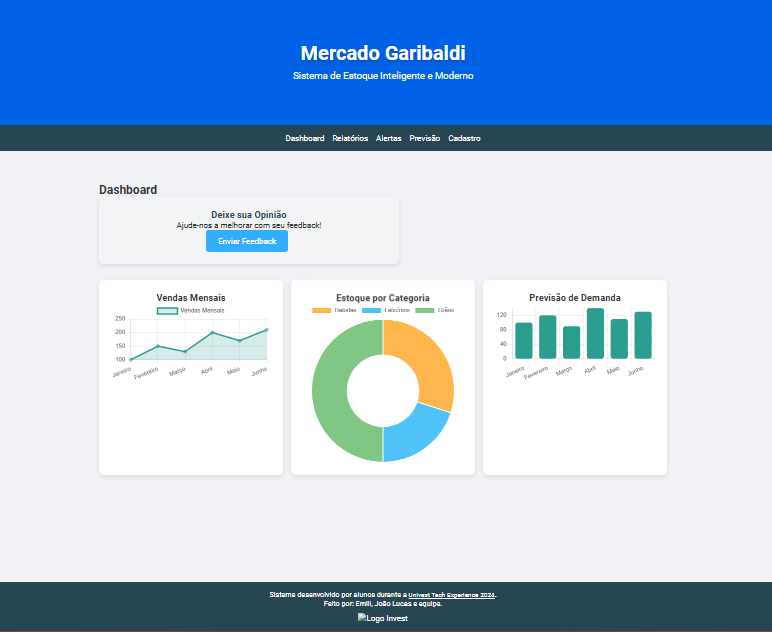
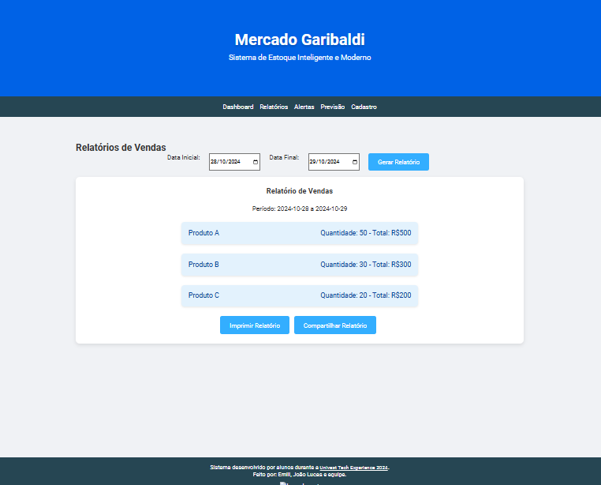

# Mercado Garibaldi - Sistema de Estoque Inteligente

Um sistema de estoque inovador e moderno, desenvolvido para facilitar o controle e a previsão de demanda em supermercados. Este projeto foi criado durante a Univest Tech Experience 2024 por equipe Invest.

 <!-- Substitua pelo caminho da sua imagem -->

---

## 🛠️ Funcionalidades

- **Dashboard Intuitivo:** Acesso rápido a gráficos de vendas, estoque por categoria e previsão de demanda.
- **Relatórios Customizáveis:** Geração de relatórios de vendas filtrados por data.
- **Alertas de Validade:** Notificações de produtos próximos do vencimento.
- **Cadastro de Produtos:** Cadastro detalhado com informações de quantidade, preço, data de validade e fornecedor.
- **Previsão de Demanda com IA:** Análise inteligente da demanda de produtos com base em dados sazonais.

## 📸 Demonstração

<!-- Coloque aqui as capturas de tela ou GIFs demonstrando as funcionalidades do site -->



## 🚀 Tecnologias Utilizadas

- **Frontend:** HTML, CSS, JavaScript
- **Gráficos:** Chart.js
- **Email para Feedback:** Integração com EmailJS
- **Inteligência Artificial:** Algoritmos de Machine Learning (simulação para previsão de demanda)

📦 **Instalação e Configuração**

### Pré-requisitos
- **Python 3.x**: Certifique-se de que o Python esteja instalado na sua máquina.
- **pip**: O gerenciador de pacotes do Python para instalar dependências.

### Passos para instalação
1. Clone o repositório:
   ```bash
   git clone https://github.com/seu-usuario/nome-do-repositorio.git
   cd nome-do-repositorio

2. Instale as dependências:
   ```bash
   Copiar código
   npm install
3. Inicie o projeto:
    ```bash
   Copiar código
   npm start

### Passos para o BACK-END

1. python -m venv env

2. env\Scripts\activate (no windows); source env/bin/activate (no mac)

   2.1 Caso dê erro ao ativar script no windows, digite no powershell (como administrador) Set-ExecutionPolicy Unrestricted e habilite.

3. pip install -r requirements.txt

4. python app.py

5. Entrem no navegador e acesse [127.0.0.1/5000](http://127.0.0.1:5000/)
   

🗂 Estrutura do Projeto


├── instance
│   └── database.db      # Banco de dados do projeto
├── path\ to
│   ├── dashboard_screenshot.png
│   ├── report_screenshot.png
│   └── screenshot.png
├── static
│   ├── css
│   │   └── styles.css    # Estilos principais
│   ├── js
│   └── qrCodes
│       └── logo_invest.png # Logo do Invest
├── templates
│   ├── base.html         # Estrutura básica do HTML
│   ├── dashboard.html     # Página do dashboard
│   ├── produtos.html      # Página de produtos
│   ├── relatorios.html     # Página de relatórios
│   └── scanner.html       # Página do scanner
├── README.md              # Este arquivo de documentação
└── app.py                 # Arquivo principal do aplicativo

🤝 Contribuição
Contribuições são bem-vindas! Sinta-se à vontade para abrir Issues ou Pull Requests.
