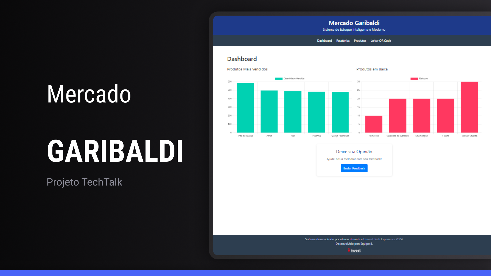
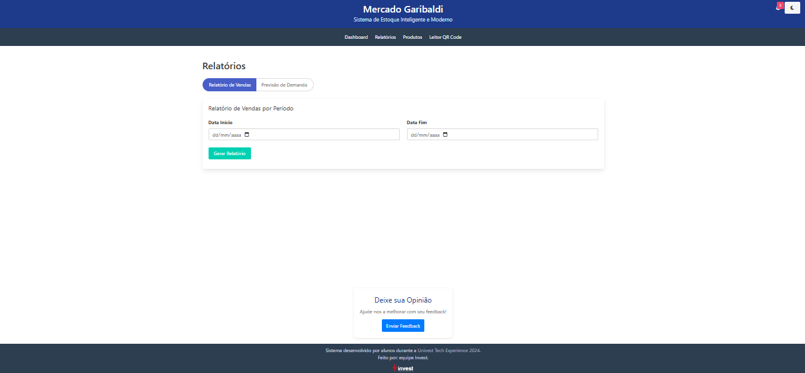
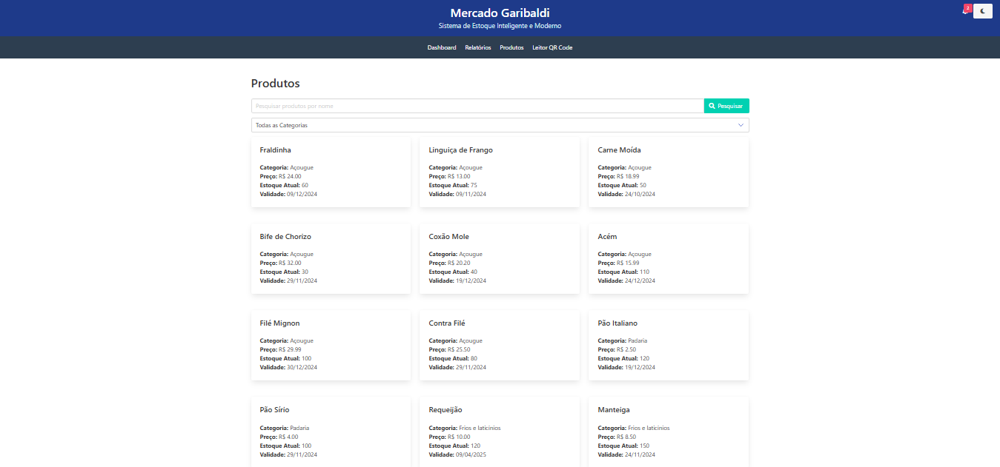
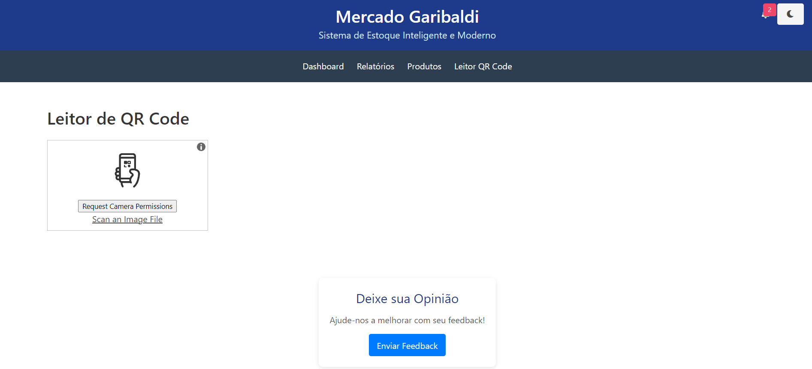

# Sistema de Previsão de Demanda para o Supermercado Garibaldi

Bem-vindo ao sistema de previsão de demanda desenvolvido para o _Supermercado Garibaldi_. Este projeto tem como objetivo otimizar a gestão de estoque através da previsão de demanda, minimizando desperdícios e garantindo a disponibilidade de produtos populares para os clientes.

## 📋 Índice

- [Descrição do Projeto](#descrição-do-projeto)
- [Funcionalidades Principais](#funcionalidades-principais)
- [Demonstração](#demonstração)
- [Tecnologias Utilizadas](#tecnologias-utilizadas)
- [Pré-requisitos](#pré-requisitos)
- [Instalação e Configuração](#instalação-e-configuração)
- [Como Executar o Projeto](#como-executar-o-projeto)
- [Uso](#uso)
- [Estrutura do Projeto](#estrutura-do-projeto)
- [Contribuição](#estrutura-do-projeto)
- [Licença](#licença)
- [Contato](https://img.shields.io/badge/Contato-Visualizar-darkorange)](#contato)

---

## 📖 Descrição do Projeto

O Supermercado Garibaldi enfrenta desafios na gestão de estoque devido a variações sazonais na demanda, resultando em prateleiras vazias para produtos populares ou excesso de itens menos procurados. Este sistema foi desenvolvido para prever a demanda futura com base em dados históricos de vendas, permitindo que o supermercado otimize seu estoque, reduza desperdícios e melhore a satisfação dos clientes.

---

## 🚀 Funcionalidades Principais

- _Dashboard Interativo_: Visualize rapidamente as vendas recentes e produtos com estoque baixo através de gráficos interativos.
- _Relatórios Personalizados_:
  - _Relatório de Vendas_: Gere relatórios de vendas por período, analisando desempenho de produtos.
  - _Previsão de Demanda_: Preveja a demanda futura de produtos específicos usando modelos estatísticos avançados.
- _Gestão de Produtos_:
  - Visualize produtos cadastrados com detalhes como nome, categoria, preço, estoque atual e data de validade.
  - Pesquise produtos por nome e filtre por categoria.
- _Leitura de QR Code_:
  - Utilize a câmera do dispositivo para ler QR Codes dos produtos.
  - Obtenha informações detalhadas do produto após a leitura.
- _Notificações_:
  - Receba alertas sobre produtos próximos ao vencimento.
  - Monitore produtos com estoque baixo.

---

## 🎯 Demonstração

<!--
Adicione aqui capturas de tela ou GIFs que demonstrem o funcionamento do sistema. Como este é um exemplo textual, descreveremos as telas:
-->

<!-- 1. *Dashboard*: Exibe gráficos de vendas recentes e produtos com estoque baixo. -->



<!-- 2. *Relatórios*: Permite a geração de relatórios de vendas e previsão de demanda. -->



<!-- 3. *Produtos*: Lista de produtos com opção de pesquisa e filtro por categoria. -->



<!-- 4. *Leitor de QR Code*: Interface para leitura de QR Codes e exibição de informações do produto. -->



## 🛠️ Tecnologias Utilizadas

- _Linguagem de Programação_: Python 3.x
- _Framework Web_: Flask
- _Banco de Dados_: SQLite
- _Frontend_:
  - _HTML5_ e _CSS3_
  - _Bulma CSS_ (Framework CSS responsivo)
  - _JavaScript_ com _ES6+_
- _Bibliotecas e Ferramentas_:
  - _Chart.js_: Para gráficos interativos.
  - _Prophet_: Biblioteca para previsão de demanda.
  - _html5-qrcode_: Biblioteca para leitura de QR Codes no navegador.
  - _Pandas_ e _NumPy_: Manipulação e análise de dados.
  - _SQLite3_: Banco de dados leve e fácil de usar.

---

## 📋 Pré-requisitos

Antes de começar, certifique-se de ter o seguinte instalado em sua máquina:

- _Python 3.x_
- _pip_ (gerenciador de pacotes do Python)
- _Git_ (opcional, se for clonar o repositório)

---

## ⚙️ Instalação e Configuração

### 1. Clone o Repositório

```bash
git clone https://github.com/seu_usuario/supermercado-garibaldi.git
cd supermercado-garibaldi

2. Crie um Ambiente Virtual

Crie um ambiente virtual para isolar as dependências do projeto.

python -m venv env

3. Ative o Ambiente Virtual

    No Windows:
      env\Scripts\activate

source env/bin/activate

Nota: Se receber um erro ao ativar o script no Windows, execute o PowerShell como administrador e digite:

Set-ExecutionPolicy RemoteSigned
Escolha "A" para "Sim para Todos".
4. Instale as Dependências

pip install -r requirements.txt

▶️ Como Executar o Projeto

Com o ambiente virtual ativado e as dependências instaladas, execute o seguinte comando para iniciar a aplicação:

python app.py
A aplicação estará disponível em http://127.0.0.1:5000/.

💻 Uso
1. Acessar a Aplicação

Abra o navegador e acesse:

http://127.0.0.1:5000/

2. Navegação pelo Sistema

    Dashboard:
        Visualize gráficos de vendas recentes e produtos com estoque baixo.
    Relatórios:
        Gere relatórios de vendas por período.
        Faça previsões de demanda selecionando um produto e período desejado.
    Produtos:
        Veja a lista de produtos cadastrados.
        Pesquise por nome e filtre por categoria.
    Leitor de QR Code:
        Acesse o leitor de QR Code pelo menu.
        Clique em "Iniciar Leitura de QR Code" e permita o acesso à câmera.
        Aponte a câmera para o QR Code de um produto para obter suas informações.

🗂️ Estrutura do Projeto

(ESSE AQUI A GENTE FAZ DEPOIS)

📌 Versão

    Versão Atual: 1.0.0
```
